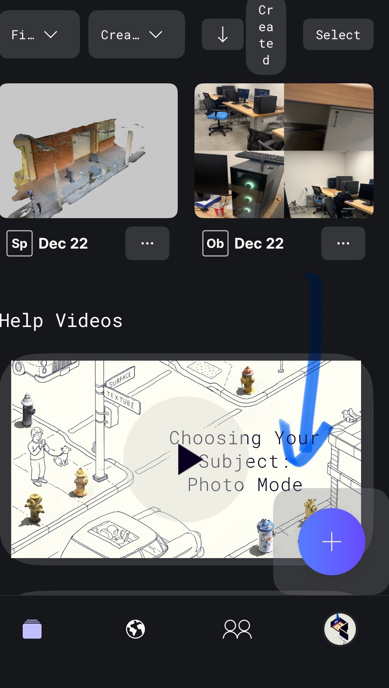
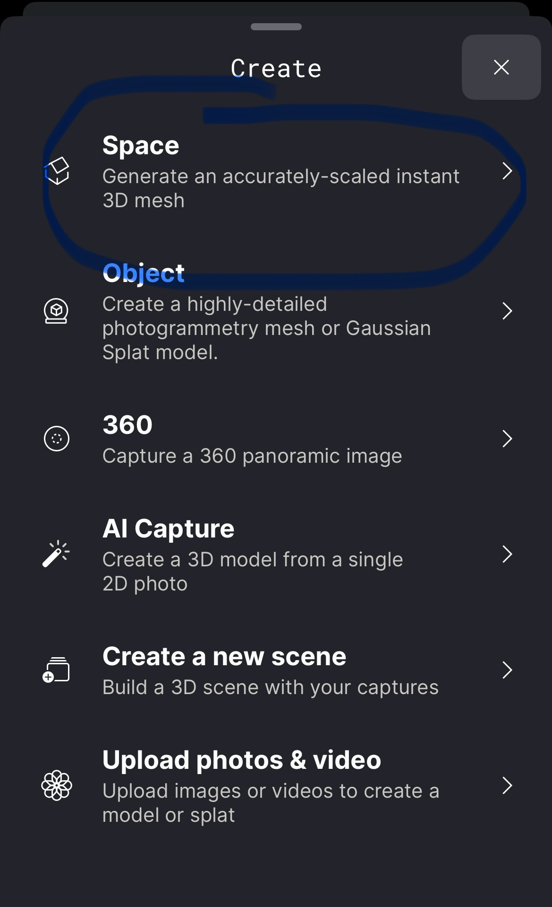
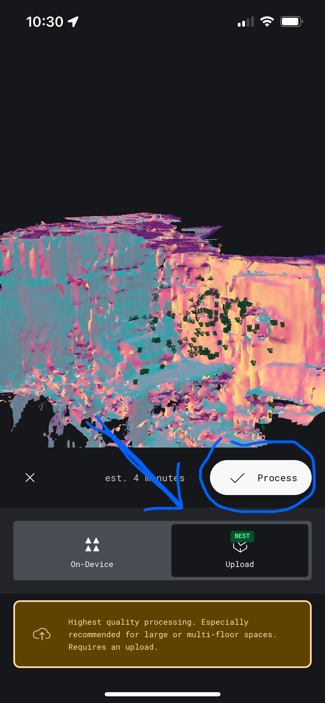
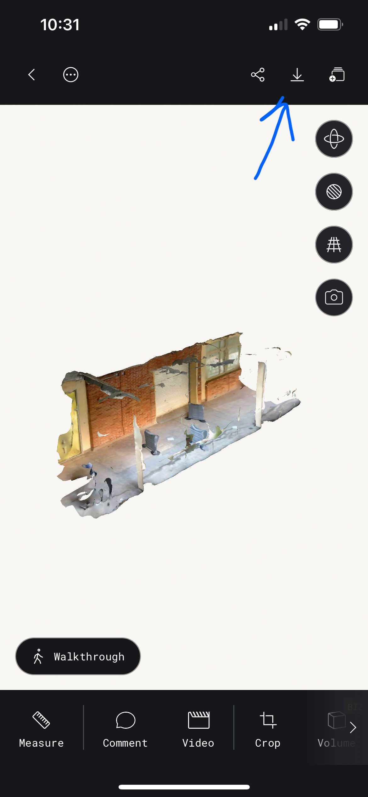
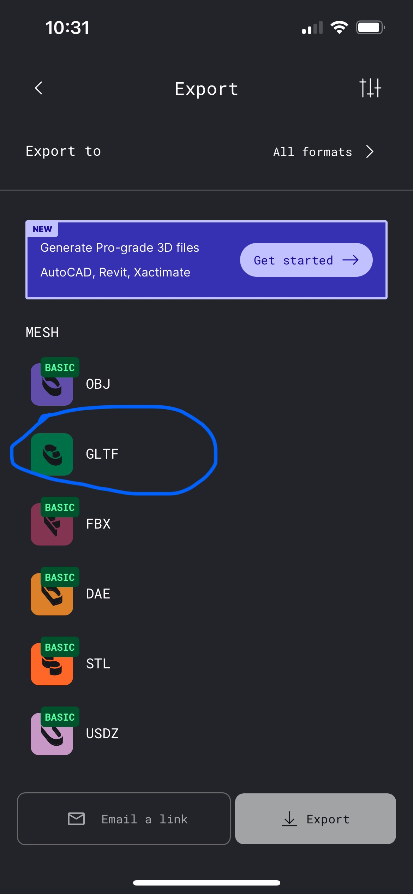
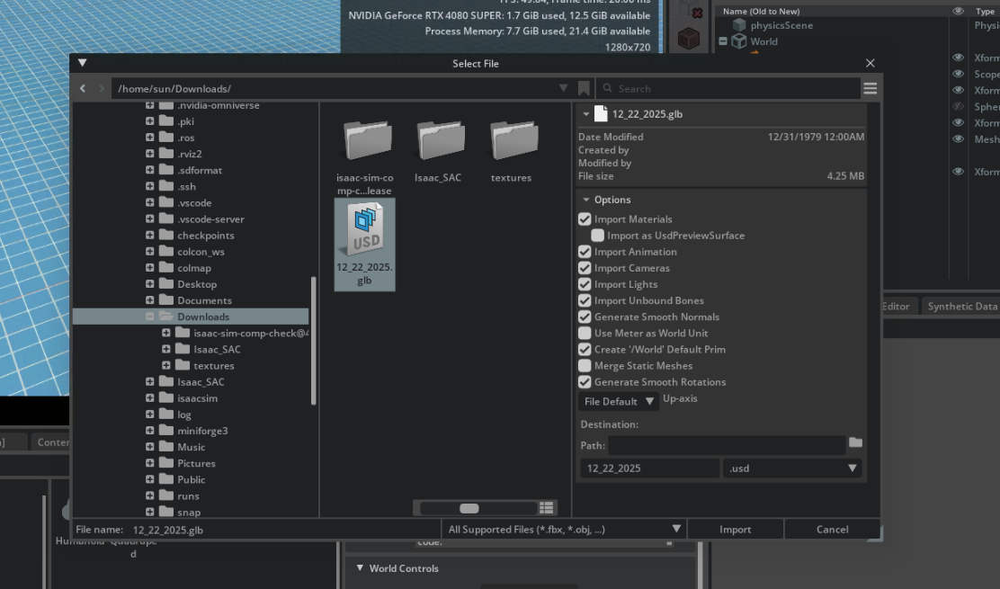
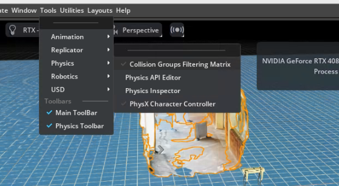

# Polycam to Isaac Sim Scene Reconstruction Guide

A comprehensive guide to reconstructing real-world environments and interacting with them in NVIDIA Isaac Sim using Polycam 3D scanning.

## Overview

This guide walks you through the complete workflow of:
1. **Scanning** a real-world scene using Polycam
2. **Exporting** the 3D reconstruction in a compatible format
3. **Importing** the reconstruction into Isaac Sim for use
4. **Interacting** with the reconstructed environment in simulation using Isaac Sim's Physics API

---

## Prerequisites

- **Polycam** app installed on iOS/Android device (LiDAR-enabled device recommended)
- **NVIDIA Isaac Sim** installed on your workstation
- Sufficient storage space for 3D scan data

---

## Part 1: Polycam - Capturing Your Scene

### Step 1: Open Polycam and Start a New Scan

Launch the Polycam app create a new scan. From there, select the mode that best fits your use case. In this example, you will be scanning a room-scale environment, so the **"space"** mode will function best. 

### Step 2: Scan Your Environment

Once you are ready, start recording. Here are some tips for a successful scan:
- Ensure good lighting conditions for better texture capture.
- Move around the space slowly and steadily, ensuring complete coverage. The app will show real-time feedback of captured areas.
- Conform to the [rules of photogrammetry](https://www.instructables.com/Shooting-for-Photogrammetry/) during your scan for best results. 
### Step 3: Process the Scan

Once you've captured the entire area, let Polycam process the scan. This may take a few minutes depending on the complexity and how many photos you took. 

### Step 4: Review Your 3D Model

Inspect the reconstructed 3D model for quality. Check for any gaps or artifacts that may need rescanning.

### Step 5: Prepare for Export

Navigate to the export options. Export your scan in **GLTF** or **GLB** format, which are well-supported by Isaac Sim. Save the file to a location accessible from your workstation.

---

## Part 2: Isaac Sim - Importing and Interacting

### Step 7: Launch Isaac Sim

Open NVIDIA Isaac Sim on your workstation. Create a new stage or open an existing project.

### Step 8: Import the 3D Model & Setting Up the Scene

Navigate to **File > Import** or use the Content Browser to locate your exported GLTF/GLB file. Import it into your scene. Then, adjust the position, rotation, and scale of your imported model to fit your simulation requirements. Use the transform tools to move around your object in the viewport.

### Step 10: Configure Physics and Collisions

Now, you will add a collision mesh to enable your object to interact with robots and other simulated objects. 

First, navigate to **Tools > Physics** and select **Physics API Editor**. Now, in the bottom window, select the new Physics API Editor tab. Select your object, and then click "Apply Static." This applies collision to the current selection. 

### Step 11: Interact with the Reconstructed Scene

Your scene is now ready for simulation! You can add robots, run physics simulations, and interact with the reconstructed environment.

> **Note:** Here I am using one of the prebuilt example robots in IsaacSim to demonstrate interaction with the reconstructed environment. You can find this by navigating to **Window > Examples > Robotics Examples** and then in the **Robotics Examples** panel, select the **Policy** dropdown and choose the Quadruped robot. Note that loading this robot will wipe your current scene, so be sure to either save your scene or redo your previous steps after loading the robot. 

---

## Example Files

Sample files are provided in the `example/` directory:

| File | Description |
|------|-------------|
| `polycam_example.gltf` | The full example scene used in this guide |
| `sample_scan.glb` | The example GLB scan used in this guide |

---

## Troubleshooting

### Common Issues

- **Model appears too small/large:** Polycam exports may use different unit scales. Adjust the scale factor during import.
- **Missing textures:** Ensure texture files are in the same directory as the GLTF file, or use GLB format.
- **Performance issues:** For large scans, consider decimating the mesh in Polycam before export.

---

## Final Note
This guide provides a simplified workflow for integrating real-world scans into Isaac Sim. For a more advanced implementation utilizing the **colmap -> 3dgrut -> IsaacSim** pipline, refer [here](https://developer.nvidia.com/blog/reconstruct-a-scene-in-nvidia-isaac-sim-using-only-a-smartphone/?ncid=so-link-160265&es_id=819cb0cc7b).